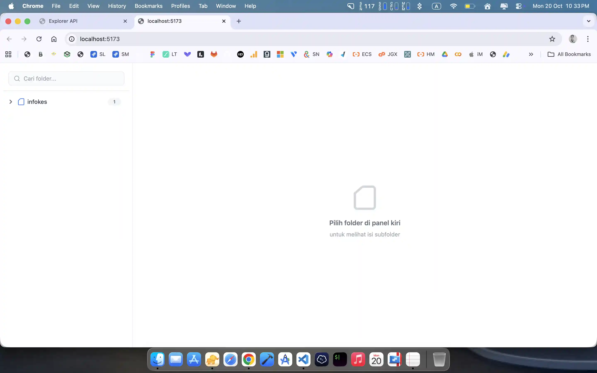
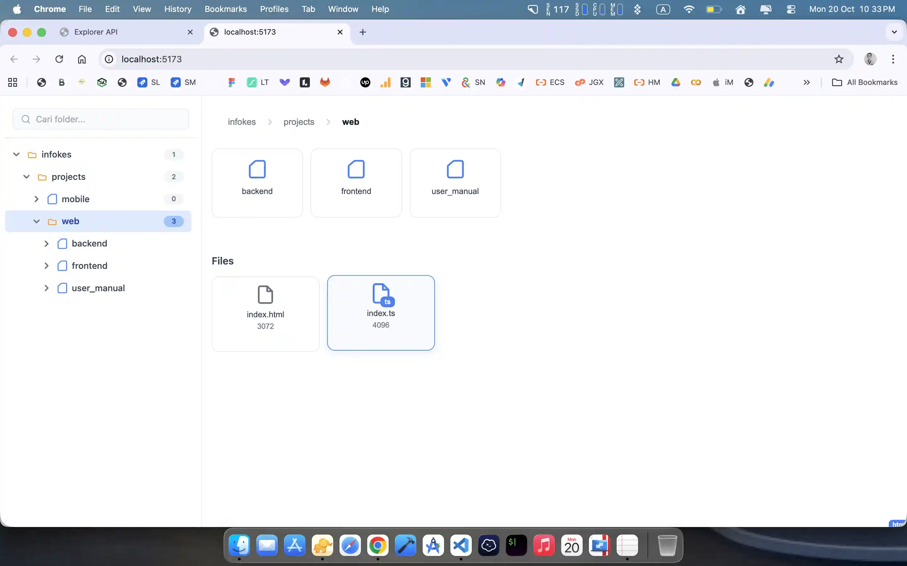
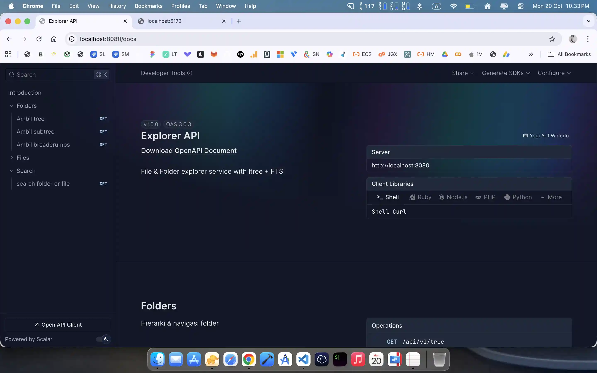
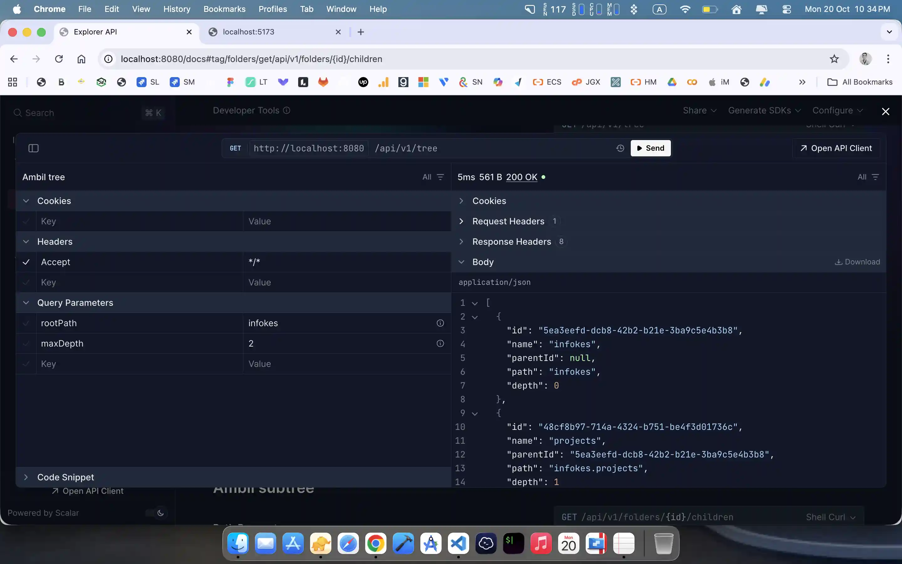

# 🗂️ Windows Explorer Backend + Frontend

Backend API untuk aplikasi Windows Explorer-like berbasis web. Dibangun dengan arsitektur hexagonal (clean architecture), menggunakan Bun + Elysia + PostgreSQL + Redis, dan dioptimalkan untuk scalability.

### example for ltree
```
sequenceDiagram
  autonumber
  participant UI as Vue3 UI (composable/usecase FE)
  participant API as Elysia Controller
  participant UC as UseCase: SearchItems (BE)
  participant Cache as Redis
  participant Repo as Postgres (FTS)

  UI->>API: GET /search?q=<query>&scope=<ltree_scope>
  API->>UC: call SearchItems(q, scope)
  UC->>Cache: GET search:{scope}:{norm_q}
  alt miss cache
    UC->>Repo: SELECT ... WHERE path_ltree <@ scope
    UC->>Repo: AND search_vector @@ plainto_tsquery('simple', unaccent(q))
    Repo-->>UC: items[]
    UC->>Cache: SET search:{scope}:{norm_q} TTL=30s
  else hit cache
    Cache-->>UC: items[]
  end
  UC-->>API: items[]
  API-->>UI: 200 OK
```

## 🚀 Tech Stack
### Backend
- **Runtime**: Bun
- **Framework**: Elysia
- **Architecture**: Hexagonal / Clean Architecture
- **Database**: PostgreSQL + ltree + FTS (GIN index)
- **ORM**: Drizzle ORM
- **Caching**: Redis
- **Connection Pooling**: PgBouncer
- **Testing**: k6, wrk, Spectral, EXPLAIN ANALYZE
- **API Spec**: OpenAPI (Scalar) + Spectral linting
- **Monorepo**: explorer-api & explorer-infrastructure
### frontend
- **Runtime**: Bun
- **Library**: Vue3 + Naive UI (Scratch TreeNode)
- **Architecture**: Hexagonal / Clean Architecture
- **Testing**: 
- **Monorepo**: explorer-fe

## 📁 Features

- Hierarchical folder structure with unlimited depth (ltree)
- Full-text search for files (FTS with GIN index)
- REST API with versioning and audit rules
- Redis caching for subtree and search results
- Connection pooling with PgBouncer for high concurrency
- Load testing with k6 and wrk
- Query profiling with EXPLAIN ANALYZE

## 📸 Application Preview Gallery

### 🔷 Frontend Preview
| Screenshot | Screenshot |
|-----------|-----------|
| <a href="./docs/gallery/frontend-1.webp"></a> | <a href="./docs/gallery/frontend-2.webp"></a> |

> *Klik gambar untuk memperbesar*

---

### 🔶 Backend Preview
| Screenshot | Screenshot |
|-----------|-----------|
| <a href="./docs/gallery/backend-1.webp"></a> | <a href="./docs/gallery/backend-2.webp"></a> |

> *Klik gambar untuk memperbesar*

## 📦 Folder Structure

```
📦backend
 ┗ 📂explorer
 ┃ ┣ 📂api
 ┃ ┃ ┣ 📂docs
 ┃ ┃ ┣ 📂scripts
 ┃ ┃ ┣ 📂src
 ┃ ┃ ┃ ┣ 📂config
 ┃ ┃ ┃ ┣ 📂di
 ┃ ┃ ┃ ┣ 📂plugins
 ┃ ┃ ┃ ┣ 📂routes
 ┃ ┃ ┣ 📂tests
 ┃ ┃ ┃ ┣ 📂load
 ┃ ┃ ┃ ┃ ┣ 📜k6-tree.js
 ┃ ┃ ┃ ┃ ┗ 📜wrk-tree.sh
 ┃ ┃ ┃ ┣ 📂query
 ┃ ┃ ┃ ┗ 📜e2e.app.test.ts
 ┃ ┃ ┣ 📜.spectral.yaml
 ┃ ┃ ┗ 📜package.json
 ┃ ┣ 📂application
 ┃ ┃ ┗ 📂src
 ┃ ┃ ┃ ┣ 📂dto
 ┃ ┃ ┃ ┣ 📂errors
 ┃ ┃ ┃ ┣ 📂ports
 ┃ ┃ ┃ ┗ 📂usecases
 ┃ ┣ 📂infrastructure
 ┃ ┃ ┣ 📂db
 ┃ ┃ ┣ 📂drizzle
 ┃ ┃ ┣ 📂src
 ┃ ┃ ┃ ┣ 📂adapter
 ┃ ┃ ┃ ┃ ┣ 📜fts.ts
 ┃ ┃ ┃ ┃ ┗ 📜redis.cache.ts
 ┃ ┃ ┃ ┣ 📂mappers
 ┃ ┃ ┃ ┗ 📂repositories
 ┃ ┃ ┣ 📂tests
 ┃ ┣ 📂reports
 ┃ ┃ ┗ 📜junit.xml
📦frontend
 ┗ 📂explorer
 ┃ ┣ 📂src
 ┃ ┃ ┣ 📂application
 ┃ ┃ ┃ ┣ 📂ports
 ┃ ┃ ┃ ┣ 📂stores
 ┃ ┃ ┃ ┗ 📂usecases
 ┃ ┃ ┣ 📂domain
 ┃ ┃ ┣ 📂infrastructure
 ┃ ┃ ┃ ┣ 📂api
 ┃ ┃ ┃ ┗ 📂core
 ┃ ┃ ┃ ┃ ┗ 📜api-client.ts
 ┃ ┃ ┣ 📂presentation
 ┃ ┃ ┃ ┣ 📂components
 ┃ ┃ ┃ ┗ 📂pages
 ┃ ┃ ┗ 📂shared
 ┃ ┣ 📜.gitignore
 ┃ ┣ 📜README.md
 ┃ ┣ 📜bun.lock
 ┃ ┣ 📜index.ts
 ┃ ┣ 📜package.json
 ┃ ┗ 📜tsconfig.json
 ┃ ┣ 📜.env
 ┃ ┣ 📜.gitignore
 ┃ ┣ 📜README.md
 ┃ ┣ 📜bunfig.toml
 ┃ ┗ 📜tsconfig.json
```

## 📄 API Spec

OpenAPI spec tersedia di `api/docs/openapi.json`, dilint dengan Spectral untuk memastikan standar REST (versioning, naming, method, etc).

## 🧪 Load Testing

- `tests/load/k6-subtree.js`
- `tests/load/k6-search.js`
- `tests/load/wrk-subtree.sh`

## 📊 Query Profiling

- `tests/query/explain-subtree.sql`

## ✅ Requirements / Test By

### Runtime & OS
- **Bun** ≥ `1.2.22`
- **OS**: macOS

### Services
- **PostgreSQL**: `14`
  - Extensions: `ltree`
- **Redis** ≥ `7.2.7`

## 📌 Setup

1. Clone repository:
```shell
git clone https://github.com/yogithesymbian/windows-explorer-bun-elysia-vue-hexagonal
```
2. go to directory `windows-explorer-bun-elysia-vue-hexagonal` and Install Package 
```shell
bun install
```
3. Setup ENV
```shell
bun run setup:env
```
4. Configuration Backend
```shell
bun run db:migrate
bun run db:seed
```
5. Running For Backend
```ts
bun run dev:api
```
```ts
$ bun --filter explorer-api --env-file=./backend/explorer/.env dev
explorer-api dev $ bun run --watch src/index.ts
│ 🦊 Elysia running at http://localhost:8080
│ 🦊 UI spec http://localhost:8080/docs
│ 🦊 RAW spec http://localhost:8080/docs/openapi.json
└─ Running...
```
6. Running For Frontend
```ts
bun run dev:fe
```
```ts
$ bun --filter explorer-fe --env-file=./frontend/explorer/.env dev
explorer-fe dev $ bun --bun vite
│ 
│   VITE v7.1.11  ready in 283 ms
│ 
│   ➜  Local:   http://localhost:5173/
│   ➜  Network: use --host to expose
└─ Running...
```


##  🧠 Author
Yogi Arif Widodo